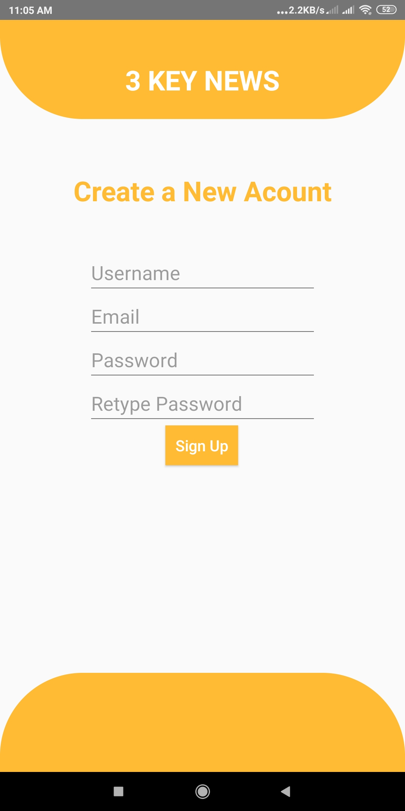
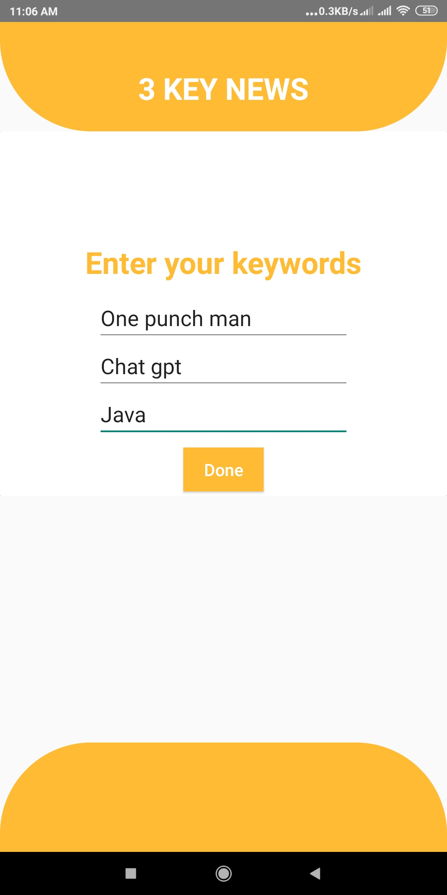
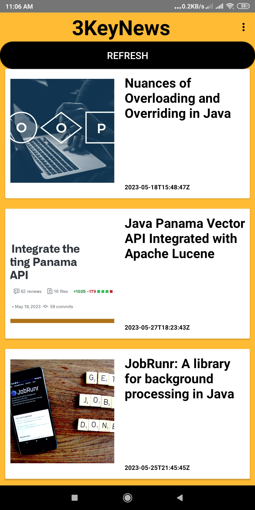
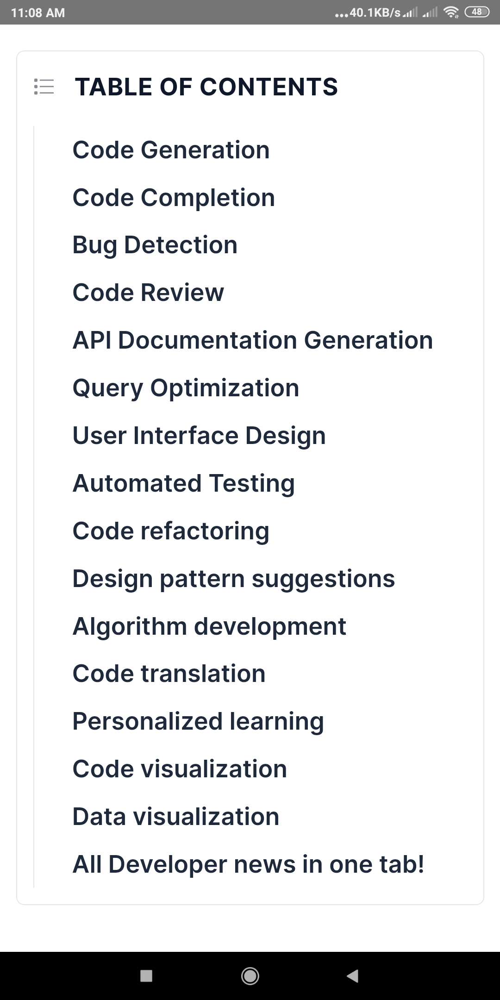

This is a news app. The app will ask for three keywords from the user. Then the app will show 9 news articles,3 for each keyword.
 The app will also save the news artciles for offline reading. For that the user have to finish checking the complete news article while online. The whole
proccess might take 5-10 minutes depending on the user's internet speed.
## Screenshots

